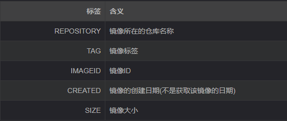
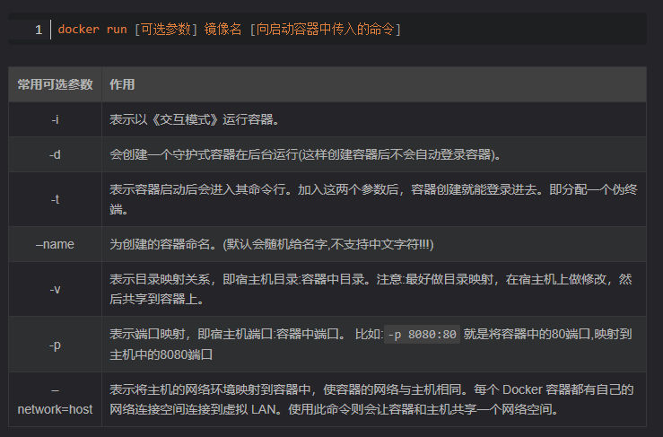
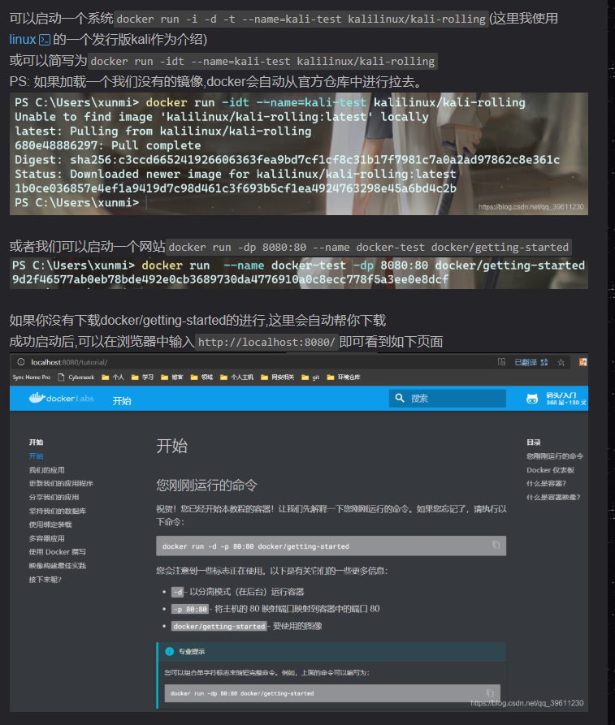
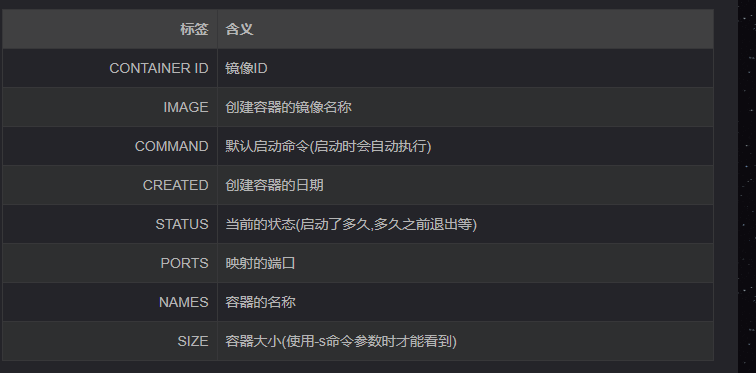

# 1基础操作

参考：https://blog.csdn.net/qq_39611230/article/details/108641842

## 1.对Docker操作
安装完成Docker后,默认每次开机的时候都会自动启动,但我们也可以手动启动,关闭或者重启Docker
```
# 启动docker
sudo service docker start
# 重启docker
sudo service docker restart
# 停止docker
sudo service docker stop
————————————————
```


## 2.对镜像的基础操作

获取当时所有镜像(docker images)
```
docker image ls
# 或者
docker images


```

## 3.拉取镜像(docker pull)
除了使用官方的镜像外,我们还可以在仓库中申请一个自己的账号,保存自己制作的进行,或者拉去使用他人的镜像。

```
# 官方镜像
docker image pull 镜像名称 
# 或简写为 
docker pull 镜像名称
# 比如
docker pull ubuntu
docker pull ubuntu:16.04

# 个人镜像
docker pull 仓库名称/镜像名称
docker pull xunmi/django

# 第三方仓库拉去
docker pull 第三方仓库地址/仓库名称/镜像名称
docker pull hub.c.163.com/library/mysql:latest
(默认仓库名为library,所有从官方获取镜像相当于`sudo docker image pull library/镜像名称`)

```


## 4.删除镜像(docker rmi)
```
docker image rm 镜像名或镜像ID 或 docker rmi 镜像名或镜像ID
docker image rm hello-world
docker rmi 9e64176cd8a2
```

删除镜像的前提是没有使用这个镜像的容器,如果有需要先删除容器(报错:Error response from daemon: conflict: unable to delete 镜像ID (must be forced) - image is being used by stopped container 容器ID则代表有容器使用了此镜像。)可以尝试先执行docker rm 容器ID删除容器,如果还报错,可以看下方删除容器的具体方法。


几条删除命令的区别：

-docker rm: 删除一个或多个 容器
-docker rmi: 删除一个或多个 镜像
-docker prune: 用来删除不再使用的 docker 对象

## 5.加载镜像(docker run)


上面我们说过,镜像只是一个只读类型的文件,而我们的环境不可能只是一个这样的文件,所以我们需要把这个镜像加载成我们的环境,也就是让他变成容器。



**例子：**



注：（使用交互式容器）
上面我们成功将镜像变成了容器,但上述的命令中我们都加入了-d,让容器在后台运行了。下面我们就来讲如何和正在运行的容器进行交互。7才是讲后台的。


## 6.查看容器(docker ps)
查看容器主要会用到ps命令：

```
# 查看当前所有正在运行的容器
docker ps
# 查看当前所有的容器
docker ps -a
# 使用过滤器(除了name外,常用的还可以指定id:id= 、所有停止的容器:status=exited,正在运行的容器:status=running 等)
docker ps -f name=指定的名字
# 显示2个上次创建的容器(2可以改变)
docker ps -n 2
# 显示最新创建的容器（包括所有状态）
docker ps -l
# 仅显示ip
docker ps -q
 # 显示容器大小
docker ps -s
```




## 7.启动和关闭容器

之前我们下过一个kali并且放在了后台运行,如果没有下载可以执行下列命令(docker run -i -d -t --name=kali-test kalilinux/kali-rolling),下面我们就用下面的命令开启kali(如果你下的是其他系统,比如ubuntu也可以举一反三一下)
首先我们确保我们要进入的容器是开启状态的,使用docker ps -a查看其中的STATUS属性是否是Up开头,如果不是先照着上面启动容器的方法开启容器
我们开启容器后,如果需要在容器内执行命令,可以将后台切换到前台,也可能使用docker命令将我们需要执行的命令传入。


操作方法有很多种,这里我们介绍一些比较常用的方法:
```
# 如果我只需要执行简单的一两条命令可以使用docker exec
# 执行单条命令 (-i: 启动并且保留交互式命令行; -t:作用是分配一个虚拟的终端; docker run )
docker exec -it 容器名或容器id 执行的命令
# 比如
docker exec -it kali-test whoami
# 用这种方法,我们还可以启动命令行,根据Linux的特性,系统程序会在/bin中,linux中常用的Shell有多个,其中大部分用的Linux默认的为bash
# 所以我们启动命令可以自行如下命令(除了/bin/bash外,linux一般还会带/bin/sh、/bin/rbash、/bin/dash等,具体区别可以自行百度)
docker exec -it 容器名或容器id /bin/bash
# 比如
docker exec -it kali-test /bin/bash
# 除了exec外还有attach可以使用,但它有个弊端,多终端启动attach后,都会会同步显示。如果有一个窗口阻塞了，那么其他窗口也无法再进行操作。
docker attach 容器名或容器id
# 比如
docker attach kali-test
```


## 8.制作镜像

我们为什么要把容器制作成镜像?

1.镜像可以看作为是一种备份,如果我们后期环境出现了问题,可以还原到早期镜像。
2.镜像便于传播,可以让自己的其他设备或他人的重复利用变得更加简单容易。

```
# 将容器制作成镜像
docker commit 容器名 镜像名
# 镜像打包备份(打包备份的文件会自动存放在当前命令行的路径下,如果想让保存的文件可以打开,可以加.tar后缀)
docker save -o 保存的文件名 镜像名
# 镜像解压
docker load -i 文件路径/备份文件

```
